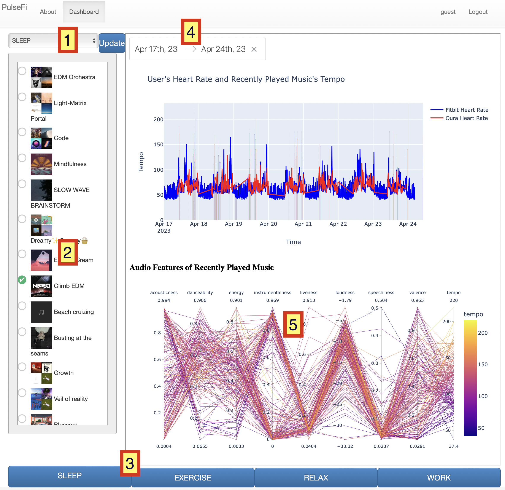

# PulseFi?

PulseFi uses music and health APIs to study the effect of music on human physiology, allowing users to control their body and mind through music selection based on data analysis.

# How to use PulseFi?

vist the website: https://pulse-fi.herokuapp.com/

Note:
    only optimized for desktop use, mobile use is not recommended

there is extensive setup required to deploy the app between the setting up the postgres database and setting up the developer accounts for fitbit and spotify. Instead of providing the extensive list of environment variables and account information, the app is deployed on heroku and can be used by visiting the website.

upon visiting the website click on the login button in the top left hand corner, click the "login as guest" button to use the credientials of Matthew Nann. This will allow you to use the app without needing to own a fitbit or spotify account. If you would like to use your own fitbit or spotify account, can register an account with PulseFi by clicking the "register" button in the top left hand corner. Once logged in, navigate to the dashboard page to see all data.

## dashboard page

### selecting user's spotify playlist to be used in each mode
1 - select between Sleep, Exercise, Relax, Work with drop down menu
2 - select a playlist from the user's spotify account

### once updated, the playlist will be used in the selected mode
3 - start a mode, which cause music from selected playlists to be played on the user's spotify account (if guest account, the music will be played on the guest account, if registered account, the music will be played on the user's spotify account)

### data analysis
4 - select the date range to view the played music and heart rate data
5 - interact with the parallel coordinate graph by dragging along the a vertical axis to select a range of songs to view, double click to remove the selection

